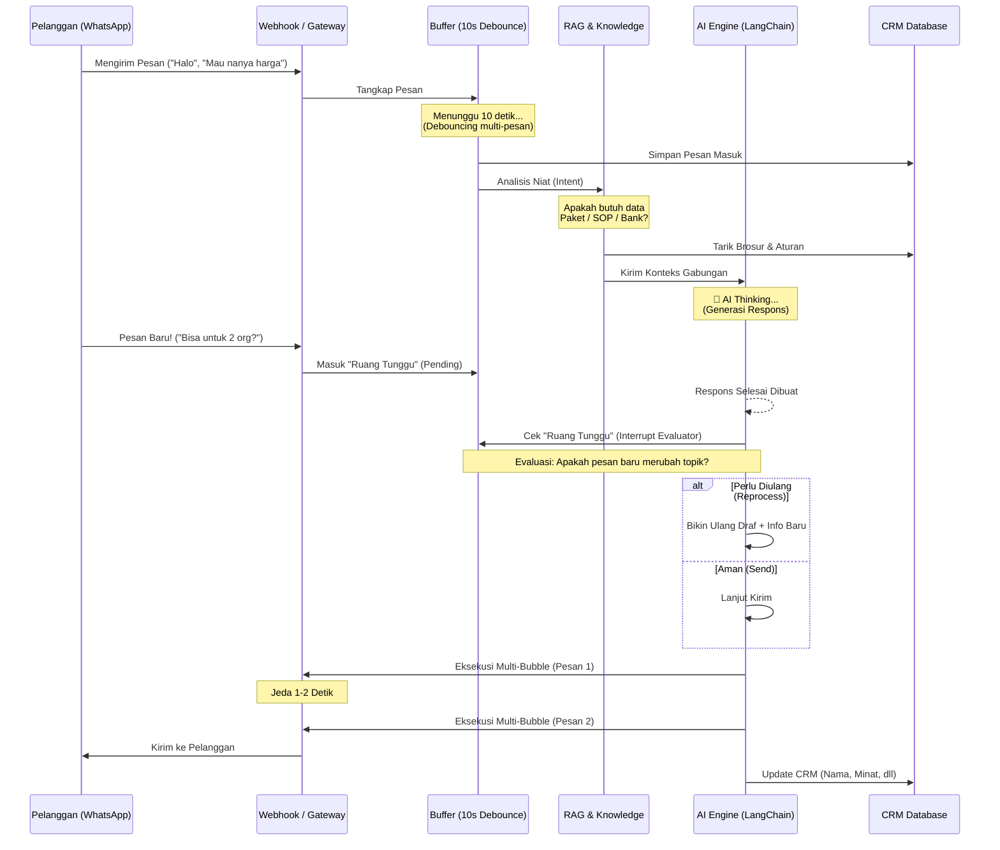

# Whitepaper Arsitektur Sistem Luevora AI CRM

Dokumen ini menjelaskan rancangan sistem di balik Luevora AI CRM. Sistem ini dirancang untuk menangani interaksi pelanggan secara otomatis via WhatsApp, bertindak sebagai *Top Closer* (agen penjualan ahli) dengan perilaku yang natural layaknya manusia, bukan sekadar chatbot biasa.

---

## 🛠️ Teknologi & Stack Sistem

Luevora dibangun di atas arsitektur Node.js modern dengan pendekatan *modular*. Berikut adalah tumpukan teknologi (Tech Stack) dan library utama yang menggerakkan sistem ini:

- **Backend & API Server:** Node.js dengan framework **Express.js**.
- **Database & ORM:** MySQL sebagai penyimpanan data relasional utama, diakses melalui **Prisma ORM** (`@prisma/client`) untuk query yang aman dan terstruktur.
- **Gateway WhatsApp (Hybrid Transport):**
    - **whatsapp-web.js:** Menggunakan *Puppeteer* secara *headless* untuk meniru sesi WhatsApp Web, memungkinkan pengiriman pesan tanpa biaya API pihak ketiga.
    - **Twilio API:** Tersedia sebagai cadangan (*fallback/switchmode*) untuk stabilitas webhook skala besar. Sistem menggunakan *Environment Variables* untuk berpindah gateway secara dinamis tanpa mengubah kode.
- **Mesin Kecerdasan Buatan (AI Engine):** 
    - **LangChain (`@langchain/openai`, `@langchain/core`):** Framework utama untuk menyusun rantai logika (prompting, RAG, memori).
    - **OpenAI API / LLM Provider:** Menggunakan model *state-of-the-art* (seperti GPT-4o-mini atau setara) untuk pemrosesan bahasa natural dan *Vision* (membaca gambar).
- **Real-Time Sinkronisasi UI:** **Server-Sent Events (SSE)** digunakan untuk memantulkan pesan baru dan status *typing* dari backend langsung ke Dashboard Admin tanpa perlu *refresh* halaman.

---

## 📊 Diagram Alur Sistem (Flowchart End-to-End)

---

## 1. Konsep Dasar & Alur Utama (End-to-End Flow)

Secara garis besar, ketika seorang pelanggan mengirimkan pesan WhatsApp ke nomor bisnis Anda, inilah yang terjadi di balik layar dalam hitungan detik:

1. **Penerimaan Pesan:** Pesan masuk ditangkap oleh sistem (melalui `waWeb.service.js` atau Twilio).
2. **Buffer "Tunggu Sebentar" (Debouncing):** Diatur oleh `messageBuffer.service.js`. Sistem tidak langsung membalas. Ia menunggu selama 10 detik. Mengapa? Karena manusia sering memecah pesannya ("halo kak" ... *kirim* ... "mau tanya harga" ... *kirim*). Sistem mengumpulkan semua pecahan pesan ini menjadi satu kesatuan sebelum memprosesnya.
3. **Analisis Konteks:** `contextAnalyzer.service.js` mengecek apakah kumpulan pesan tersebut membahas 1 topik yang sama, atau membahas 2 hal yang berbeda sama sekali.
4. **Pencarian Data Pintar (Agentic RAG):** Diatur oleh `rag.service.js` dan `documentReader.service.js`. AI membaca dokumen internal bisnis Anda (harga paket, SOP, ketersediaan) untuk mencari jawaban yang tepat.
5. **Pembuatan Strategi Balasan (Multi-Bubble Planner):** `bubble.service.js` merancang strategi cara menjawab. Alih-alih membalas dengan satu paragraf panjang yang membosankan, AI memecahnya menjadi 2 atau 3 pesan pendek (bubble) layaknya manusia mengetik.
6. **Eksekusi & Kirim:** Pesan dikirim secara berurutan dengan jeda 1-2 detik antar pesannya menggunakan `messaging.service.js`.
7. **Pencatatan CRM Otomatis:** Sambil membalas, AI diam-diam memperbarui profil pelanggan di tabel `Lead` pada database menggunakan tag khusus (mencatat nama mereka, preferensi liburan, budget, dll).

---

## 2. Arsitektur "Baca Sebelum Balas" (Interrupt-Aware Pipeline)

Ini adalah fitur tingkat lanjut (ditangani oleh modul `interruptState.js` dan `interruptEvaluator.service.js`) yang membuat AI tidak terlihat bodoh saat pelanggan menyela percakapan.

### Masalah pada Chatbot Tradisional:
Chatbot biasa akan mulai memproses pesan. Proses berpikir (mencari data + generate kata-kata) butuh waktu sekitar 3-5 detik. Jika saat 5 detik itu pelanggan mengirim pesan *lagi* ("oh iya, untuk 2 orang ya"), chatbot biasa akan mengabaikan pesan baru tersebut, membalas pesan pertama, lalu baru mulai memproses pesan kedua. Hasilnya? Percakapan yang tumpang tindih dan membingungkan.

### Solusi Luevora (Interrupt-Aware):
- Saat AI sedang sibuk berpikir (membuat draft balasan), lalu ada pesan baru masuk, sistem menampung pesan baru tersebut ke dalam "Ruang Tunggu" (*Shared Pending State*).
- **Tepat sebelum AI menekan tombol "Kirim"**, AI diwajibkan untuk menengok ke Ruang Tunggu.
- **Evaluasi Kilat (Micro AI Call):** AI melakukan pengecekan dalam waktu 0.5 detik menggunakan LLM berkecepatan tinggi: 
  * *"Apakah draf balasan saya saat ini sudah menjawab pesan baru yang baru saja masuk?"*
  * Jika pesannya hanya sekadar "oke kak" atau "sip", AI akan me-return JSON: `{"verdict": "SEND"}`.
  * Jika pesannya "oh iya, untuk tanggal 12 bisa?", AI akan me-return JSON: `{"verdict": "REPROCESS"}`. (Buat ulang drafnya dengan tambahan info tanggal 12!).
- Hasilnya: AI selalu merespons sesuai konteks terbaru, persis seperti CS manusia yang menghapus ketikannya saat melihat pesan baru masuk.

---

## 3. Arsitektur RAG (Retrieval-Augmented Generation) 4 Tahap

Agar AI tidak berhalusinasi (mengarang bebas) dan tahu harga, paket, serta SOP perusahaan Anda, kami menggunakan sistem RAG berlapis yang disebut *Agentic RAG*:

1. **Tahap Niat (Intent):** Saat pesan masuk, AI memutuskan: *"Apakah saya butuh buka buku pedoman SOP? Atau brosur paket wisata? Atau info bank?"*
2. **Tahap Pencocokan Judul:** AI melihat daftar isi dari semua brosur/pedoman di database, lalu memilih ID dokumen yang paling relevan.
3. **Tahap Membaca Mendalam (Deep Fetch & Vision):**
   - Jika ada teks panjang, AI membacanya secara terpotong (*chunking*) per paragraf.
   - Jika ada **gambar brosur/poster** yang dilampirkan, AI akan "melihat" gambar tersebut menggunakan teknologi Vision dari LangChain untuk mencari jawaban langsung dari gambar.
4. **Tahap Kesimpulan:** AI mengumpulkan semua fakta yang ia temukan menjadi satu *System Prompt* pasti yang tidak boleh dilanggar.

---

## 4. Sistem Balasan Multi-Bubble (Multi-Bubble Reply)

Kunci dari percakapan WhatsApp yang memikat adalah gaya mengetik yang natural.

Sistem membaginya menjadi dua langkah:
- **Sang Perencana (Planner):** AI mengevaluasi jawaban yang akan dibuat. Ia memutuskan: *"Oke, saya butuh 3 pesan. Pesan 1 untuk menyapa. Pesan 2 untuk ngasih tau harga. Pesan 3 untuk call-to-action."* Planner mereturn instruksi spesifik untuk setiap bubble.
- **Sang Pengetik (Executor):** AI membuat teks untuk masing-masing pesan secara terpisah menggunakan metode LangChain *Sequential Execution*, memastikan tidak ada informasi yang diulang antar bubble.
- **Jeda Natural:** Pesan dikirim menggunakan fungsi *delay* asinkron (misal 1500ms + random).

---

## 5. Ringkasan Memori Berjalan (Sliding Window Memory)

Jika pelanggan sudah ngobrol ratusan pesan, AI tidak mungkin mengingat semuanya karena akan melampaui *token limit* (konteks maksimal) dari LLM.
Oleh karena itu, Luevora menggunakan modul `memory.service.js`:
- Setiap kali percakapan melewati kelipatan 5 pesan baru, *Background Job* akan memicu AI untuk meringkas inti pembicaraan.
- *Contoh ringkasan:* "Pelanggan bernama Budi, minat ke Bali 3 Hari, budget menengah."
- Saat Budi chat lagi, AI utama tidak perlu membaca seluruh riwayat obrolan. AI cukup membaca ringkasan singkat tersebut, ditambah 3 chat paling terbaru (*Snippets*).
- Ini membuat sistem sangat cepat, irit biaya API, dan cerdas.

---

## 6. Proactive Media & Deteksi Pintar (CRM Auto-Update)

Kemampuan AI menyisipkan "tag ajaib" yang di-parsing oleh backend via Regex (`webhook.service.js`):
- **Proactive Media:** Jika AI mereturn `[SEND_MEDIA_CTX:PACKAGE:5]`, backend akan secara otomatis mencari file PDF/Gambar ber-ID 5 di database lokal dan mengirimkannya ke WhatsApp.
- **Tag Detektor Rahasia:** 
  * `[UPDATE_INFO: email=... | preferences=... ]`: Memerintahkan Prisma ORM untuk meng-update tabel `Lead`.
  * `[OFFER_DETECTED]`: Mengunci status penawaran harga dan membunyikan notifikasi SSE ke *Dashboard Admin*.
  * `[PAYMENT_PROOF_DETECTED]`: Mengubah status database pesanan menjadi *Pending Approval* dan membuat *Transaction log*.
  * `[SEND_INVOICE_TO]`: Memicu generator PDF (`pdfGenerator.service.js`) untuk membuat file Tagihan resmi dan mengirimkannya ke pelanggan secara otomatis.
